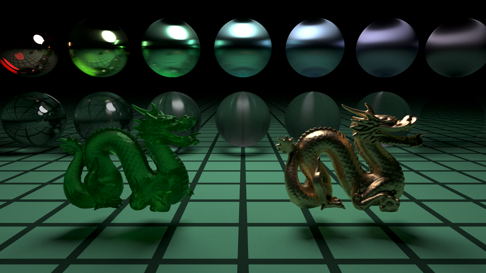
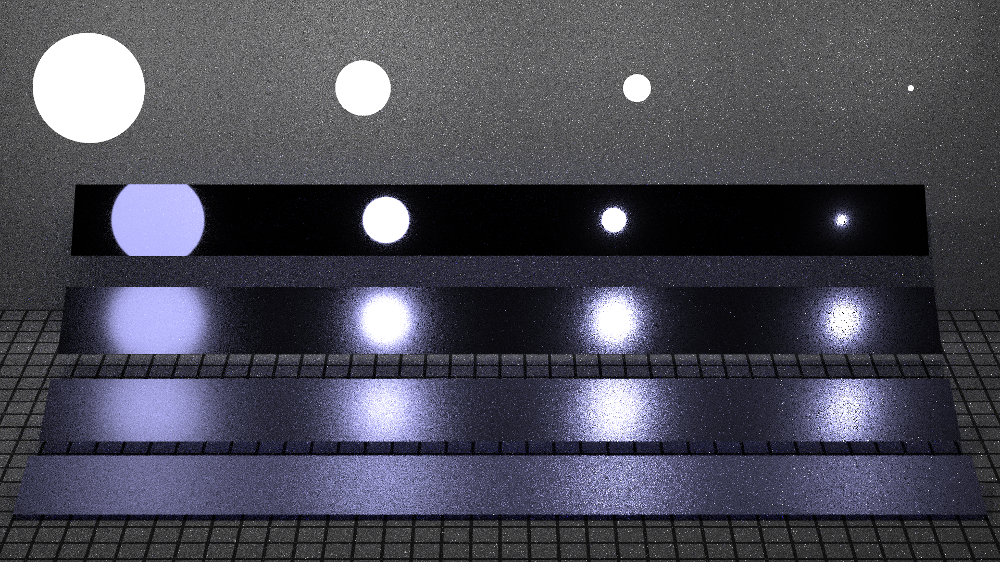
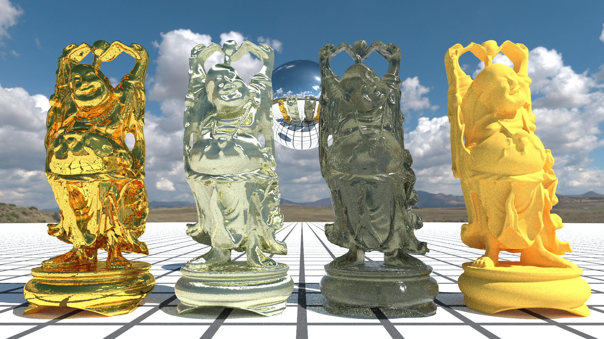
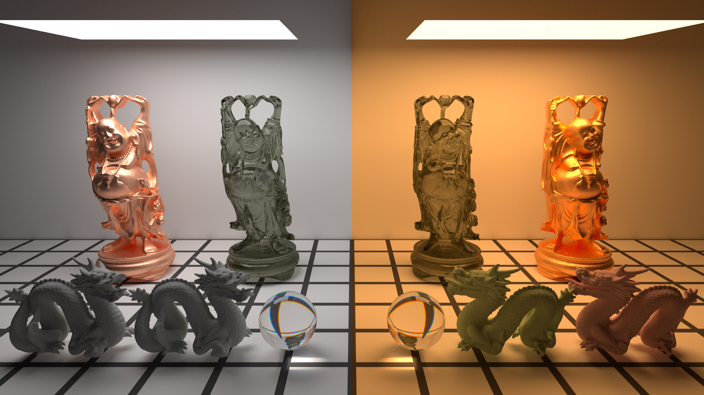
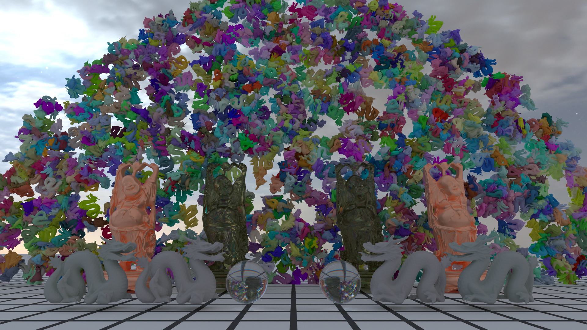

# CPU Path Tracing

一个**从零实现、面向教学的 C++17 CPU 基于物理的 路径追踪渲染器**，同时也是
[Bilibili 公开课](https://www.bilibili.com/video/BV1MJYAeYEDk) 的配套代码仓库。

## 项目简介 Intro
项目从最基础的Hello World开始，逐步实现 线程池、光线求交、BVH、路径追踪、重要性采样、
微表面模型、光源采样、MIS、环境光照以及光谱路径追踪。

实现上尽量贴近算法本身，少用复杂框架和语言技巧，方便对照原理阅读代码。

## 功能 Features
- Binned SAH BVH
- Anisotropic GGX Microfacet
- Multiple Importance Sampling
- Environment Lighting
- Spectral Path Tracing
- Jakob–Hanika 2019 RGB-to-Spectrum

## 画廊 Gallery
### 各向异性微表面

`Anisotropic GGX` · `Smith Masking-Shadowing` · `Conductor` · `Dielectric`
### 多重重要性采样

`Light Sampling` · `BSDF Sampling` · `MIS`
### 环境光照

`Environment Map` · `Importance Sampling` · `HDR`
### 光谱路径追踪

`Spectral Rendering` · `Wavelength Sampling` · `Spectral MIS`
### RGB → 光谱

`Spectral Upsampling` · `RGB-to-Spectrum LUT` · `Sigmoid Polynomial Spectrum` · `RGB Illuminant Image`

## 公开课 Course
<table>
  <thead>
    <tr>
      <th align="center">讲次</th>
      <th align="center">内容</th>
      <th align="center">视频</th>
      <th align="center">课件</th>
      <th align="center">代码</th>
    </tr>
  </thead>
  <tbody>
    <tr>
      <th colspan="5" align="center">基础框架</th>
    </tr>
    <tr>
      <td align="center">01</td>
      <td align="center">课程介绍</td>
      <td align="center"><a href="https://www.bilibili.com/video/BV1MJYAeYEDk">视频</a></td>
      <td align="center"><a href="resource/L01%20课程介绍.pptx">PPT</a></td>
      <td align="center"><a href="../../tree/Lecture01">Lecture01</a></td>
    </tr>
    <tr>
      <td align="center">02</td>
      <td align="center">线程池与胶片</td>
      <td align="center"><a href="https://www.bilibili.com/video/BV17NakepE1k">视频</a></td>
      <td align="center"><a href="resource/L02%20线程池与胶片.pptx">PPT</a></td>
      <td align="center"><a href="../../tree/Lecture02">Lecture02</a></td>
    </tr>
    <tr>
      <td align="center">03</td>
      <td align="center">自旋锁与并行 for 循环</td>
      <td align="center"><a href="https://www.bilibili.com/video/BV1U8a2eDEgD">视频</a></td>
      <td align="center">—</td>
      <td align="center"><a href="../../tree/Lecture03">Lecture03</a></td>
    </tr>
    <tr>
      <td align="center">04</td>
      <td align="center">球体与相交测试</td>
      <td align="center"><a href="https://www.bilibili.com/video/BV1ffaDe7Ewf">视频</a></td>
      <td align="center"><a href="resource/L04%20球体与相交测试.pptx">PPT</a></td>
      <td align="center"><a href="../../tree/Lecture04">Lecture04</a></td>
    </tr>
    <tr>
      <td align="center">05</td>
      <td align="center">模型渲染</td>
      <td align="center"><a href="https://www.bilibili.com/video/BV1nrYtesEcN">视频</a></td>
      <td align="center"><a href="resource/L05%20模型渲染.pptx">PPT</a></td>
      <td align="center"><a href="../../tree/Lecture05">Lecture05</a></td>
    </tr>
    <tr>
      <td align="center">06</td>
      <td align="center">平面与场景</td>
      <td align="center"><a href="https://www.bilibili.com/video/BV1WbYve2Ebi">视频</a></td>
      <td align="center"><a href="resource/L06%20平面与场景.pptx">PPT</a></td>
      <td align="center"><a href="../../tree/Lecture06">Lecture06</a></td>
    </tr>
    <tr>
      <td align="center">07</td>
      <td align="center">材质与极简光追</td>
      <td align="center"><a href="https://www.bilibili.com/video/BV1QKY9e5E6S">视频</a></td>
      <td align="center"><a href="resource/L07%20材质与极简光追.pptx">PPT</a></td>
      <td align="center"><a href="../../tree/Lecture07">Lecture07</a></td>
    </tr>
    <tr>
      <td align="center">08</td>
      <td align="center">一些代码重构</td>
      <td align="center"><a href="https://www.bilibili.com/video/BV1baYCe2Evy">视频</a></td>
      <td align="center">—</td>
      <td align="center"><a href="../../tree/Lecture08">Lecture08</a></td>
    </tr>
    <tr>
      <th colspan="5" align="center">性能优化与路径追踪</th>
    </tr>
    <tr>
      <td align="center">09</td>
      <td align="center">性能优化（上）：并行优化</td>
      <td align="center"><a href="https://www.bilibili.com/video/BV13yexeBEsZ">视频</a></td>
      <td align="center"><a href="resource/L09%20性能优化（上）.pptx">PPT</a></td>
      <td align="center"><a href="../../tree/Lecture09">Lecture09</a></td>
    </tr>
    <tr>
      <td align="center">10</td>
      <td align="center">性能优化（中）：高性能 BVH 加速结构</td>
      <td align="center"><a href="https://www.bilibili.com/video/BV1xNpSeAEiM">视频</a></td>
      <td align="center"><a href="resource/L10%20性能优化（中）.pptx">PPT</a></td>
      <td align="center"><a href="../../tree/Lecture10">Lecture10</a></td>
    </tr>
    <tr>
      <td align="center">11</td>
      <td align="center">性能优化（下）：场景管理</td>
      <td align="center"><a href="https://www.bilibili.com/video/BV1RRWLe9EWs">视频</a></td>
      <td align="center">—</td>
      <td align="center"><a href="../../tree/Lecture11">Lecture11</a></td>
    </tr>
    <tr>
      <td align="center">12</td>
      <td align="center">路径追踪与重要性采样</td>
      <td align="center"><a href="https://www.bilibili.com/video/BV1FbnXe4EKB">视频</a></td>
      <td align="center"><a href="resource/L12%20渲染方程.pptx">PPT</a></td>
      <td align="center"><a href="../../tree/Lecture12">Lecture12</a></td>
    </tr>
    <tr>
      <td align="center">13</td>
      <td align="center">代码勘误与新材质类</td>
      <td align="center"><a href="https://www.bilibili.com/video/BV1qsHFeGEf3">视频</a></td>
      <td align="center">—</td>
      <td align="center"><a href="../../tree/Lecture13">Lecture13</a></td>
    </tr>
    <tr>
      <td align="center">14</td>
      <td align="center">电介质与导体</td>
      <td align="center"><a href="https://www.bilibili.com/video/BV1dhHeeKEyk">视频</a></td>
      <td align="center"><a href="resource/L14%20电介质与导体.pptx">PPT</a></td>
      <td align="center"><a href="../../tree/Lecture14">Lecture14</a></td>
    </tr>
    <tr>
      <th colspan="5" align="center">微表面、采样与光照</th>
    </tr>
    <tr>
      <td align="center">15</td>
      <td align="center">往期勘误与代码重构</td>
      <td align="center"><a href="https://www.bilibili.com/video/BV1vYo1YTEBJ">视频</a></td>
      <td align="center">—</td>
      <td align="center"><a href="../../tree/Lecture15">Lecture15</a></td>
    </tr>
    <tr>
      <td align="center">16</td>
      <td align="center">微表面理论</td>
      <td align="center"><a href="https://www.bilibili.com/video/BV1hLdoYsEjH">视频</a></td>
      <td align="center"><a href="resource/L16%20微表面理论.pptx">PPT</a></td>
      <td align="center"><a href="../../tree/Lecture16">Lecture16</a></td>
    </tr>
    <tr>
      <td align="center">17</td>
      <td align="center">实时预览</td>
      <td align="center"><a href="https://www.bilibili.com/video/BV1RSGSzLELK">视频</a></td>
      <td align="center">—</td>
      <td align="center"><a href="../../tree/Lecture17">Lecture17</a></td>
    </tr>
    <tr>
      <td align="center">18</td>
      <td align="center">向光源采样</td>
      <td align="center"><a href="https://www.bilibili.com/video/BV1EubezjEKA">视频</a></td>
      <td align="center"><a href="resource/L18%20向光源采样.pptx">PPT</a></td>
      <td align="center"><a href="../../tree/Lecture18">Lecture18</a></td>
    </tr>
    <tr>
      <td align="center">19</td>
      <td align="center">多重重要性采样</td>
      <td align="center"><a href="https://www.bilibili.com/video/BV1fob4zFEMA">视频</a></td>
      <td align="center"><a href="resource/L19%20多重重要性采样.pptx">PPT</a></td>
      <td align="center"><a href="../../tree/Lecture19">Lecture19</a></td>
    </tr>
    <tr>
      <td align="center">20</td>
      <td align="center">BVH 构建优化</td>
      <td align="center"><a href="https://www.bilibili.com/video/BV1SReLz8E2V">视频</a></td>
      <td align="center">—</td>
      <td align="center"><a href="../../tree/Lecture20">Lecture20</a></td>
    </tr>
    <tr>
      <td align="center">21</td>
      <td align="center">环境光照</td>
      <td align="center"><a href="https://www.bilibili.com/video/BV17ZeUzqEqg">视频</a></td>
      <td align="center"><a href="resource/L21%20环境光照.pptx">PPT</a></td>
      <td align="center"><a href="../../tree/Lecture21">Lecture21</a></td>
    </tr>
    <tr>
      <th colspan="5" align="center">光谱渲染</th>
    </tr>
    <tr>
      <td align="center">22</td>
      <td align="center">代码勘误和一些改进</td>
      <td align="center"><a href="https://www.bilibili.com/video/BV1GiNZ6aEJD">视频</a></td>
      <td align="center">—</td>
      <td align="center"><a href="../../tree/Lecture22">Lecture22</a></td>
    </tr>
    <tr>
      <td align="center">23</td>
      <td align="center">光谱渲染（上）色彩科学</td>
      <td align="center"><a href="https://www.bilibili.com/video/BV19nKv6TExV">视频</a></td>
      <td align="center"><a href="resource/L23%20光谱渲染（上）色彩科学.pptx">PPT</a></td>
      <td align="center"><a href="../../tree/Lecture23">Lecture23</a></td>
    </tr>
    <tr>
      <td align="center">24-1</td>
      <td align="center">光谱渲染（中）基础框架</td>
      <td align="center"><a href="https://www.bilibili.com/video/BV18gup6TE4S">视频</a></td>
      <td align="center"><a href="resource/L24%20光谱渲染（中）光谱路径追踪.pptx">PPT</a></td>
      <td align="center"><a href="../../tree/Lecture24">Lecture24</a></td>
    </tr>
    <tr>
      <td align="center">24-2</td>
      <td align="center">光谱渲染（中）Spectral MIS</td>
      <td align="center"><a href="https://www.bilibili.com/video/BV1dcuV6HEMo">视频</a></td>
      <td align="center"><a href="resource/L24%20光谱渲染（中）光谱路径追踪.pptx">PPT</a></td>
      <td align="center"><a href="../../tree/Lecture24">Lecture24</a></td>
    </tr>
    <tr>
      <td align="center">25</td>
      <td align="center">光谱渲染（下）RGB转光谱</td>
      <td align="center"><a href="https://www.bilibili.com/video/BV1eN8u6dE3y">视频</a></td>
      <td align="center"><a href="resource/L25%20光谱渲染（下）RGB转光谱.pptx">PPT</a></td>
      <td align="center"><a href="../../tree/Lecture25">Lecture25</a></td>
    </tr>
  </tbody>
</table>

## 代码构建 Build
### 获取源码
```bash
git clone --recursive https://github.com/HeaoYe/CPUPathTracing.git
```

### 下载资源文件
- 新建models、hdris、spectrums文件夹
- 下载[资源文件](https://github.com/HeaoYe/CPUPathTracing/releases)
- 将.obj模型文件放入models文件夹
- 将.exr贴图文件放入hdris文件夹
- 将.csv光谱文件放入spectrums文件夹
- 文件夹结构预览
 ```txt
 CPUPathTracing
 ├── hdris
 │   ├── HdrOutdoorSnowMountainsEveningClear001_HDR_4K.exr
 │   ├── kloppenheim_07_puresky_4k.exr
 │   └── qwantani_night_puresky_4k.exr
 ├── models
 │   ├── buddha.obj
 │   ├── dragon_871k.obj
 │   ├── dragon_87k.obj
 │   └── simple_dragon.obj
 ├── spectrums
 │   ├── Johnson-copper.csv
 │   ├── Metameric_A_reflectance.csv
 │   ├── Metameric_B_reflectance.csv
 │   └── Zelmon-glass.csv
 ├── resource/
 ├── source/
 ├── thirdparty/
 ├── .vscode/
 ├── CMakeLists.txt
 ├── .gitignore
 ├── .gitmodules
 ├── README.md
 └── LICENSE
 ```

### 编译
```bash
cmake -B build
cmake --build build -j 8
```

### 运行
```bash
./build/source/CPUPathTracing
```
第一次运行会在spectrums文件夹自动生成LUT文件

## 操作 Controls
程序启动后会进入实时预览界面，可调整相机位置、视角与预览模式。

| 操作 | 功能 |
| :---: | --- |
| <kbd>Enter</kbd> | 开始渲染 |
| <kbd>Esc</kbd> | 退出预览，不进行渲染 |
| <kbd>Caps Lock</kbd> | 捕获 / 释放鼠标 |
| <kbd>W</kbd> <kbd>A</kbd> <kbd>S</kbd> <kbd>D</kbd> | 移动相机 |
| <kbd>Space</kbd> / <kbd>Shift</kbd> | 相机上升 / 下降 |
| 鼠标移动 | 调整相机视角 |
| 鼠标滚轮 | 调整相机 FOV |
| <kbd>Tab</kbd> | 切换预览模式 |
| <kbd>+</kbd> / <kbd>-</kbd> | 调整预览目标 FPS，并自动改变预览分辨率 |

`Tab` 可在以下预览模式之间切换：
- 正常渲染
- 法线可视化
- BVH 包围盒相交测试热力图
- 三角形相交测试热力图

## 参考资料 References
- [Physically Based Rendering: From Theory to Implementation, 4th Edition](https://pbr-book.org/4ed/contents)
  Matt Pharr, Wenzel Jakob, Greg Humphreys, 2023.

- [Robust Monte Carlo Methods for Light Transport Simulation](https://graphics.stanford.edu/papers/veach_thesis/)
  Eric Veach, Ph.D. dissertation, Stanford University, 1997.

- [On fast Construction of SAH-based Bounding Volume Hierarchies](https://publications.sci.utah.edu/publications/wald07/fastbuild.pdf)
  Ingo Wald, IEEE/Eurographics Symposium on Interactive Ray Tracing, 33–40, 2007.

- [Microfacet Models for Refraction through Rough Surfaces](https://www.cs.cornell.edu/~srm/publications/EGSR07-btdf.html)
  Bruce Walter, Stephen R. Marschner, Hongsong Li, Kenneth E. Torrance, Eurographics Symposium on Rendering (EGSR), 195–206, 2007.

- [Understanding the Masking-Shadowing Function in Microfacet-Based BRDFs](https://jcgt.org/published/0003/02/03/)
  Eric Heitz, Journal of Computer Graphics Techniques (JCGT), 3(2), 48–107, 2014.

- [Sampling the GGX Distribution of Visible Normals](https://jcgt.org/published/0007/04/01/)
  Eric Heitz, Journal of Computer Graphics Techniques (JCGT), 7(4), 1–13, 2018.

- [A re-determination of the trichromatic coefficients of the spectral colours](https://doi.org/10.1088/1475-4878/30/4/301)
  W. D. Wright, Transactions of the Optical Society, 30(4), 141–164, 1929.

- [A re-determination of the mixture curves of the spectrum](https://doi.org/10.1088/1475-4878/31/4/303)
  W. D. Wright, Transactions of the Optical Society, 31(4), 201–218, 1930.

- [The Colorimetric Properties of the Spectrum](https://doi.org/10.1098/rsta.1932.0005)
  John Guild, Philosophical Transactions of the Royal Society A, 230, 149–187, 1932.

- [How the CIE 1931 color-matching functions were derived from Wright-Guild data](https://doi.org/10.1002/%28SICI%291520-6378%28199702%2922%3A1%3C11%3A%3AAID-COL4%3E3.0.CO%3B2-7)
  Hugh S. Fairman, Michael H. Brill, Henry Hemmendinger, Color Research & Application, 22(1), 11–23, 1997.

- [A critical review of the development of the CIE1931 RGB color-matching functions](https://doi.org/10.1002/col.20020)
  Arthur D. Broadbent, Color Research & Application, 29(4), 267–272, 2004.

- [How the CIE 1931 RGB Color Matching Functions Were Developed from the Initial Color Matching Experiments](https://yuhaozhu.com/blog/cmf.html)
  Yuhao Zhu, blog article, 2020.

- [Hero Wavelength Spectral Sampling](https://doi.org/10.1111/cgf.12419)
  Alexander Wilkie, Sehera Nawaz, Marc Droske, Andrea Weidlich, Johannes Hanika, Computer Graphics Forum, 33(4), 123–131, 2014.

- [A Low-Dimensional Function Space for Efficient Spectral Upsampling](https://rgl.epfl.ch/publications/Jakob2019Spectral)
  Wenzel Jakob, Johannes Hanika, Computer Graphics Forum (Proceedings of Eurographics), 38(2), 147–155, 2019.

## 许可证 License
本项目原创源代码基于 [MIT License](LICENSE) 开源。

仓库中包含的第三方源代码遵循其各自的原始许可证，
相关版权与许可证声明保留在对应文件中。

`resource/` 目录中的内容不包含在 MIT License 的授权范围内。
PPT 中引用的第三方图片及其他材料，其版权归各自权利人所有。

仓库 Release 中提供的模型、HDRI、光谱数据及其他外部资源
不包含在 MIT License 的授权范围内。
